i build the layer after the first model call: routing and fallbacks, evals, document pipelines, streaming, observability. ai engineer at [august](https://www.meetaugust.ai), health ai used by millions of people. i ship cli tools and contribute upstream.

15 ai coding tools scanned with [vibecheck](https://github.com/yuvrajangadsingh/vibecheck) in august 2026, 8x between the cleanest and the noisiest. [the run and the generator](assets/)

**19 prs merged upstream** in [expensify](https://github.com/Expensify/App/pull/87128), [github cli](https://github.com/cli/cli/pull/12846), [gemini cli](https://github.com/google-gemini/gemini-cli/pull/16965), [cal.com](https://github.com/calcom/cal.com/pulls?q=is%3Apr+author%3Ayuvrajangadsingh+is%3Amerged), and google labs' [stitch-skills](https://github.com/google-labs-code/stitch-skills/pull/42), all maintainer-reviewed. [full pr index](https://github.com/search?q=is%3Apr+is%3Amerged+author%3Ayuvrajangadsingh+-user%3Ayuvrajangadsingh&type=pullrequests)

**4,904 npm downloads/month** across the clis. latest is [greens v1.8.2](https://github.com/yuvrajangadsingh/greens/releases), which keeps work-contribution mirrors private by default and refuses to sync to a public one.

field notes, every claim tested first: [i scanned 31 ai-built repos](https://dev.to/yuvrajangadsingh/i-scanned-31-ai-built-repos-each-tool-leaves-behind-a-different-mess-4k3) · [1 in 5 sites returned the wrong primary font](https://dev.to/yuvrajangadsingh/i-ran-my-own-tool-against-100-sites-1-in-5-returned-the-wrong-primary-font-2eg9)

 

open to dev-tool collabs → [hi@yuvrajangadsingh.com](mailto:hi@yuvrajangadsingh.com) · [portfolio](https://yuvrajangadsingh.com?utm_source=github&utm_medium=profile_readme&utm_campaign=profile_readme) · [linkedin](https://linkedin.com/in/yuvrajangadsingh)

*numbers verified aug 27, 2026.*
